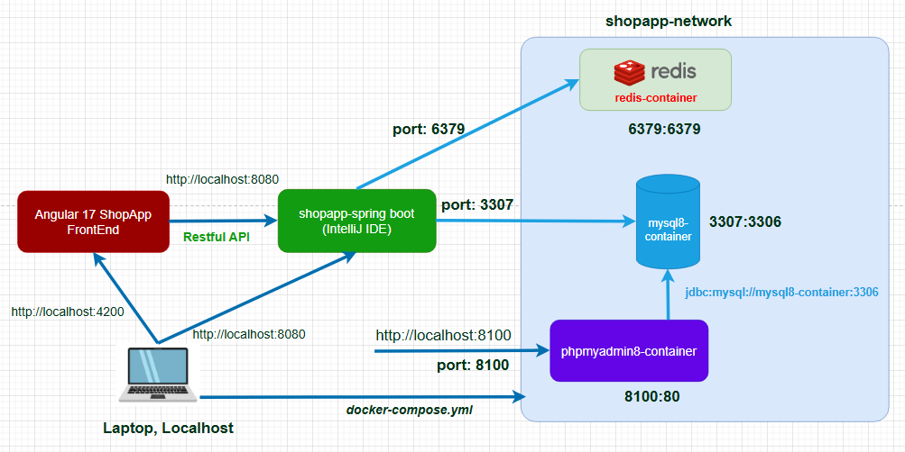

# 🛍️ ShopApp Frontend

A modular Angular 17 frontend for ShopApp — a demo e-commerce application with full customer journey support including authentication, cart management, and order placement.

## 🚀 Features

### ✅ Business Features:

- Product Management — browse product listings, view details.

- Shopping Cart — add, update, or remove items.

- Order Placement — submit and track orders.

- Payment Integration — pay securely via VNPay (Sandbox test).

- Search & Filter — find products easily.

### 🔐 Non-Business (Technical) Features:

- JWT Authentication — secure login with token-based auth.

- Social Login — sign in with Google or Facebook.

- Refresh Token Flow — seamless session renewal.

- Modular Architecture — Angular 17 module-based design.

- Error Interceptors & Guards — better UX and route protection.

## 📁 Tech Stack

- **Framework:** Angular 17.
- **Auth:** JWT + Social OAuth2.
- **State Management:** RxJS services.
- **BackEnd:** Spring Boot, REST API.

## 🛠️ How to run

### Prerequisites

- Resource from this GitHub repository.
- Node.JS, JavaScript runtime.
- Angular CLI.

### Setup Front End

```bash
    git clone https://github.com/vanhaidl93/shopapp-frontend.git
    cd shopapp-frontend
    npm install
    npm start
```

### Combine **Back End** for demo

```bash
    https://github.com/vanhaidl93/shopapp-backend.git
```

## 📦 Shopapp-architecture:


